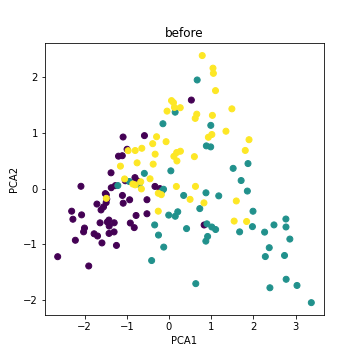
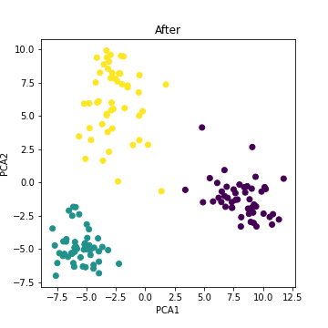

# sentencebert_japanese

Sentence Transformerによる日本語文章のベクトル化と、モデルのファインチューニングを行う。

デモ用データとして下記サイトにて配布されているlivedoor ニュースコーパスを使用している。

https://www.rondhuit.com/download.html

なお、学習速度の関係から

- 独女通信
- ITライフハック
- livedoor HOMME

の三つのカテゴリーの50記事ずつのみを利用している。

# Demo

学習前（事前学習済みのBert）を使ってエンコードした各記事の文章ベクトルの分布

※色分けは記事のカテゴリー



ファインチューニング後のSentenceTransfomerの使ってエンコードした各文章ベクトルの分布



同じカテゴリーの文章ベクトルの距離がより近くなり、異なるカテゴリーの文章同士はより遠くなるようにベクトル化することができた。

# Requirements
```
python==3.9.0
numpy==1.21.2
scipy==1.7.3
pandas==1.3.5
openpyxl==3.0.9
matplotlib==3.5.0
scikit-learn==1.0.2
nltk==3.6.5
opencv-python==4.5.5.62
ttach==0.0.3
janome==0.4.1
transformers==4.15.0
gym==0.21.0
pyglet==1.5.16
torch==1.10.0
torchvision==0.11.1
torchaudio==0.10.0
torchtext==0.11.0
torchcam==0.3.0
torchsummary==1.5.1
grad-cam==1.2.9
fugashi==1.1.1
ipadic==1.0.0
pillow==8.4.0
gensim==4.0.1
mojimoji==0.0.12
```
# Installation

```bash
$ pip install -r requirements.txt
```

